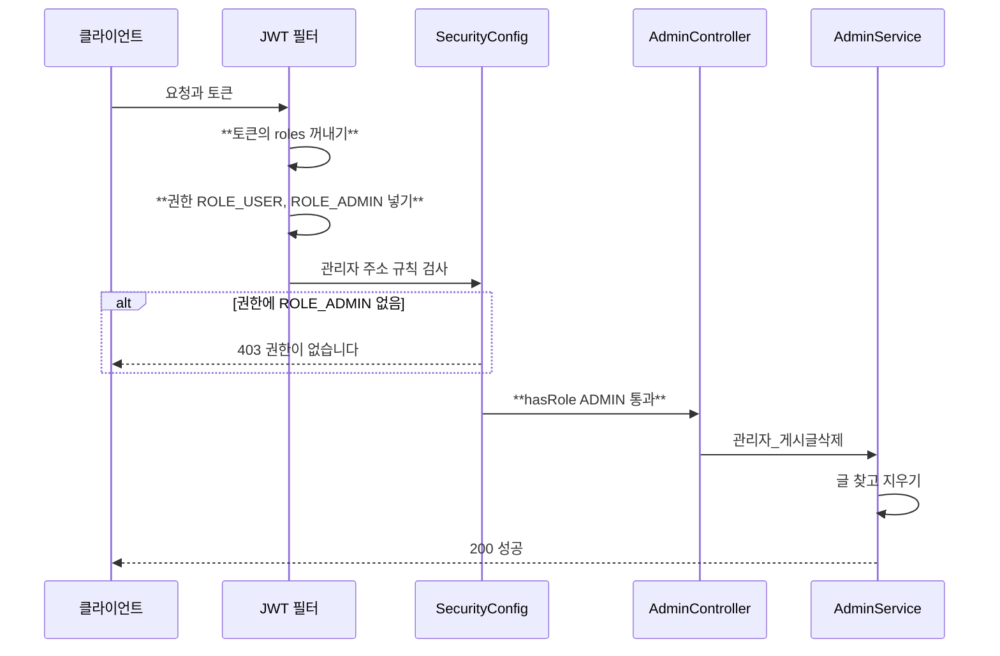

# admin-api 흐름

```mermaid
sequenceDiagram
  participant C as 클라이언트
  participant F as JWT 필터
  participant S as SecurityConfig
  participant AC as AdminController
  participant AS as AdminService
  C->>F: 요청과 토큰
  F->>F: **토큰의 roles 꺼내기**
  F->>F: **권한 ROLE_USER, ROLE_ADMIN 넣기**
  F->>S: 관리자 주소 규칙 검사
  alt 권한에 ROLE_ADMIN 없음
    S-->>C: 403 권한이 없습니다
  end
  S->>AC: **hasRole ADMIN 통과**
  AC->>AS: 관리자_게시글삭제
  AS->>AS: 글 찾고 지우기
  AS-->>C: 200 성공
```
