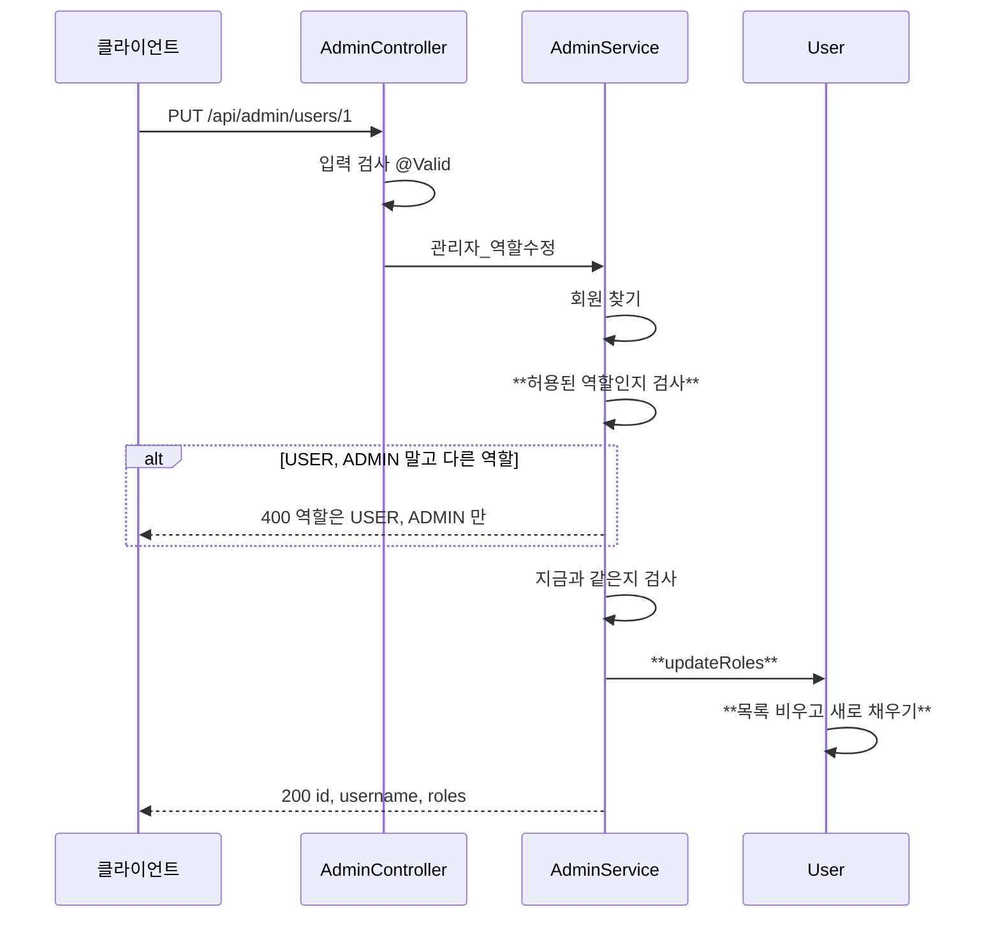

# admin-roles 흐름

```mermaid
sequenceDiagram
  participant C as 클라이언트
  participant AC as AdminController
  participant AS as AdminService
  participant U as User
  C->>AC: PUT /api/admin/users/1
  AC->>AC: 입력 검사 @Valid
  AC->>AS: 관리자_역할수정
  AS->>AS: 회원 찾기
  AS->>AS: **허용된 역할인지 검사**
  alt USER, ADMIN 말고 다른 역할
    AS-->>C: 400 역할은 USER, ADMIN 만
  end
  AS->>AS: 지금과 같은지 검사
  AS->>U: **updateRoles**
  U->>U: **목록 비우고 새로 채우기**
  AS-->>C: 200 id, username, roles
```
