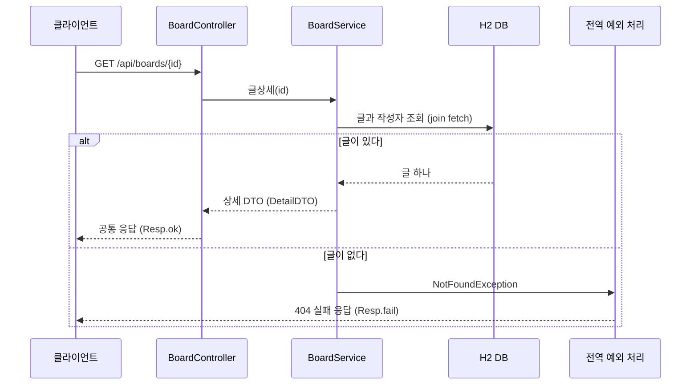

# board-detail 흐름

```mermaid
sequenceDiagram
  participant C as 클라이언트
  participant BC as BoardController
  participant BS as BoardService
  participant DB as H2 DB
  participant GH as 전역 예외 처리
  C->>BC: GET /api/boards/{id}
  BC->>BS: 글상세(id)
  BS->>DB: 글과 작성자 조회 (join fetch)
  alt 글이 있다
    DB-->>BS: 글 하나
    BS-->>BC: 상세 DTO (DetailDTO)
    BC-->>C: 공통 응답 (Resp.ok)
  else 글이 없다
    BS->>GH: NotFoundException
    GH-->>C: 404 실패 응답 (Resp.fail)
  end
```
