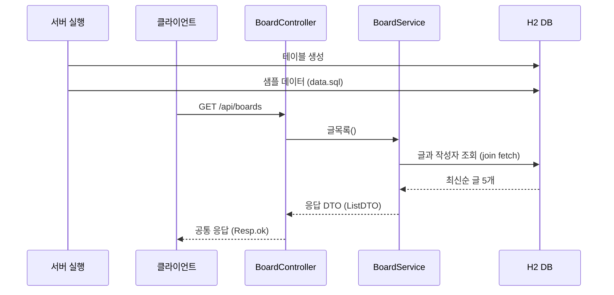

# board-list 흐름

```mermaid
sequenceDiagram
  participant S as 서버 실행
  participant C as 클라이언트
  participant BC as BoardController
  participant BS as BoardService
  participant DB as H2 DB
  S->>DB: 테이블 생성
  S->>DB: 샘플 데이터 (data.sql)
  C->>BC: GET /api/boards
  BC->>BS: 글목록()
  BS->>DB: 글과 작성자 조회 (join fetch)
  DB-->>BS: 최신순 글 5개
  BS-->>BC: 응답 DTO (ListDTO)
  BC-->>C: 공통 응답 (Resp.ok)
```
