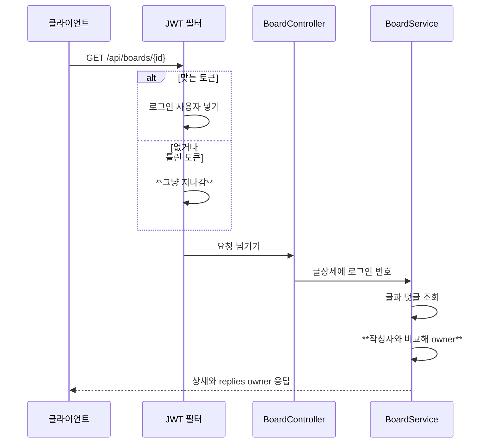

# board-owner 흐름

```mermaid
sequenceDiagram
  participant C as 클라이언트
  participant F as JWT 필터
  participant BC as BoardController
  participant BS as BoardService
  C->>F: GET /api/boards/{id}
  alt 맞는 토큰
    F->>F: 로그인 사용자 넣기
  else 없거나 틀린 토큰
    F->>F: **그냥 지나감**
  end
  F->>BC: 요청 넘기기
  BC->>BS: 글상세에 로그인 번호
  BS->>BS: 글과 댓글 조회
  BS->>BS: **작성자와 비교해 owner**
  BS-->>C: 상세와 replies owner 응답
```
