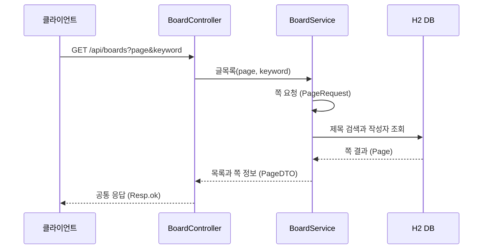

# board-paging 흐름

```mermaid
sequenceDiagram
  participant C as 클라이언트
  participant BC as BoardController
  participant BS as BoardService
  participant DB as H2 DB
  C->>BC: GET /api/boards?page&keyword
  BC->>BS: 글목록(page, keyword)
  BS->>BS: 쪽 요청 (PageRequest)
  BS->>DB: 제목 검색과 작성자 조회
  DB-->>BS: 쪽 결과 (Page)
  BS-->>BC: 목록과 쪽 정보 (PageDTO)
  BC-->>C: 공통 응답 (Resp.ok)
```
