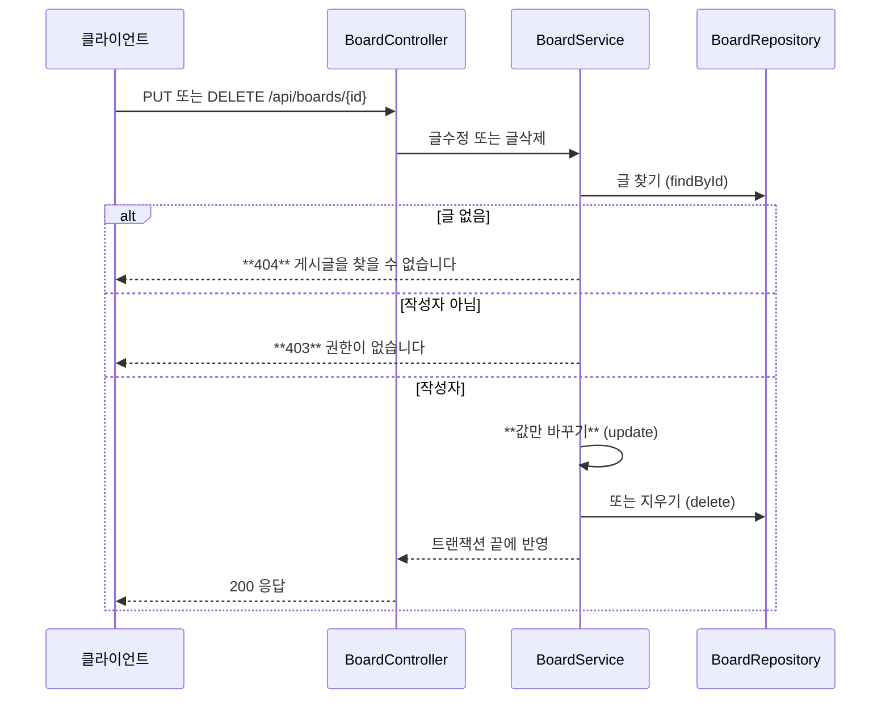

# board-update-delete 흐름

```mermaid
sequenceDiagram
  participant C as 클라이언트
  participant BC as BoardController
  participant BS as BoardService
  participant R as BoardRepository
  C->>BC: PUT 또는 DELETE /api/boards/{id}
  BC->>BS: 글수정 또는 글삭제
  BS->>R: 글 찾기 (findById)
  alt 글 없음
    BS-->>C: **404** 게시글을 찾을 수 없습니다
  else 작성자 아님
    BS-->>C: **403** 권한이 없습니다
  else 작성자
    BS->>BS: **값만 바꾸기** (update)
    BS->>R: 또는 지우기 (delete)
    BS-->>BC: 트랜잭션 끝에 반영
    BC-->>C: 200 응답
  end
```
