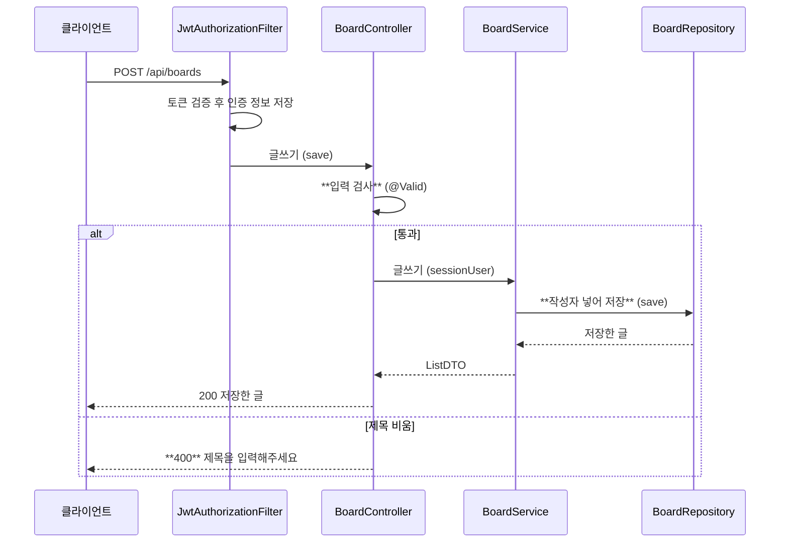

# board-write 흐름

```mermaid
sequenceDiagram
  participant C as 클라이언트
  participant F as JwtAuthorizationFilter
  participant BC as BoardController
  participant BS as BoardService
  participant R as BoardRepository
  C->>F: POST /api/boards
  F->>F: 토큰 검증 후 인증 정보 저장
  F->>BC: 글쓰기 (save)
  BC->>BC: **입력 검사** (@Valid)
  alt 통과
    BC->>BS: 글쓰기 (sessionUser)
    BS->>R: **작성자 넣어 저장** (save)
    R-->>BS: 저장한 글
    BS-->>BC: ListDTO
    BC-->>C: 200 저장한 글
  else 제목 비움
    BC-->>C: **400** 제목을 입력해주세요
  end
```
