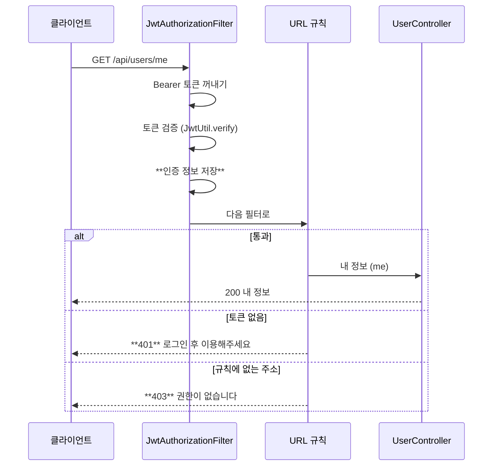

# jwt-auth 흐름

```mermaid
sequenceDiagram
  participant C as 클라이언트
  participant F as JwtAuthorizationFilter
  participant S as URL 규칙
  participant UC as UserController
  C->>F: GET /api/users/me
  F->>F: Bearer 토큰 꺼내기
  F->>F: 토큰 검증 (JwtUtil.verify)
  F->>F: **인증 정보 저장**
  F->>S: 다음 필터로
  alt 통과
    S->>UC: 내 정보 (me)
    UC-->>C: 200 내 정보
  else 토큰 없음
    S-->>C: **401** 로그인 후 이용해주세요
  else 규칙에 없는 주소
    S-->>C: **403** 권한이 없습니다
  end
```
