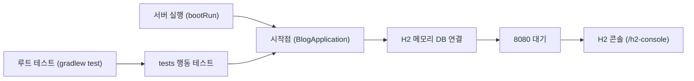

# project-setup 흐름

```mermaid
flowchart LR
  A["서버 실행 (bootRun)"] --> B["시작점 (BlogApplication)"]
  B --> C[H2 메모리 DB 연결]
  C --> D[8080 대기]
  D --> E["H2 콘솔 (/h2-console)"]
  T["루트 테스트 (gradlew test)"] --> U[tests 행동 테스트]
  U --> B
```
