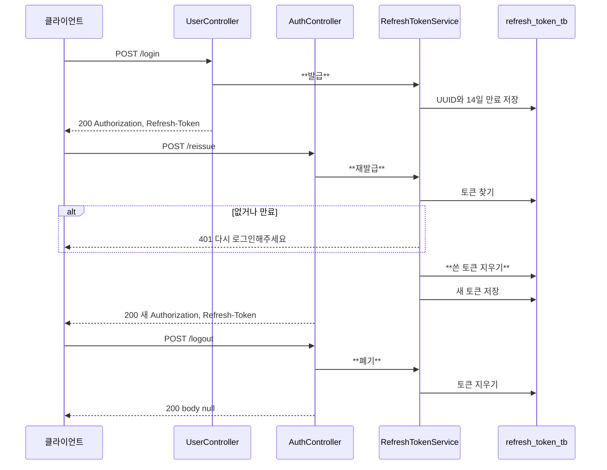

# refresh-token 흐름

```mermaid
sequenceDiagram
  participant C as 클라이언트
  participant UC as UserController
  participant AC as AuthController
  participant RS as RefreshTokenService
  participant DB as refresh_token_tb
  C->>UC: POST /login
  UC->>RS: **발급**
  RS->>DB: UUID와 14일 만료 저장
  UC-->>C: 200 Authorization, Refresh-Token
  C->>AC: POST /reissue
  AC->>RS: **재발급**
  RS->>DB: 토큰 찾기
  alt 없거나 만료
    RS-->>C: 401 다시 로그인해주세요
  end
  RS->>DB: **쓴 토큰 지우기**
  RS->>DB: 새 토큰 저장
  AC-->>C: 200 새 Authorization, Refresh-Token
  C->>AC: POST /logout
  AC->>RS: **폐기**
  RS->>DB: 토큰 지우기
  AC-->>C: 200 body null
```
