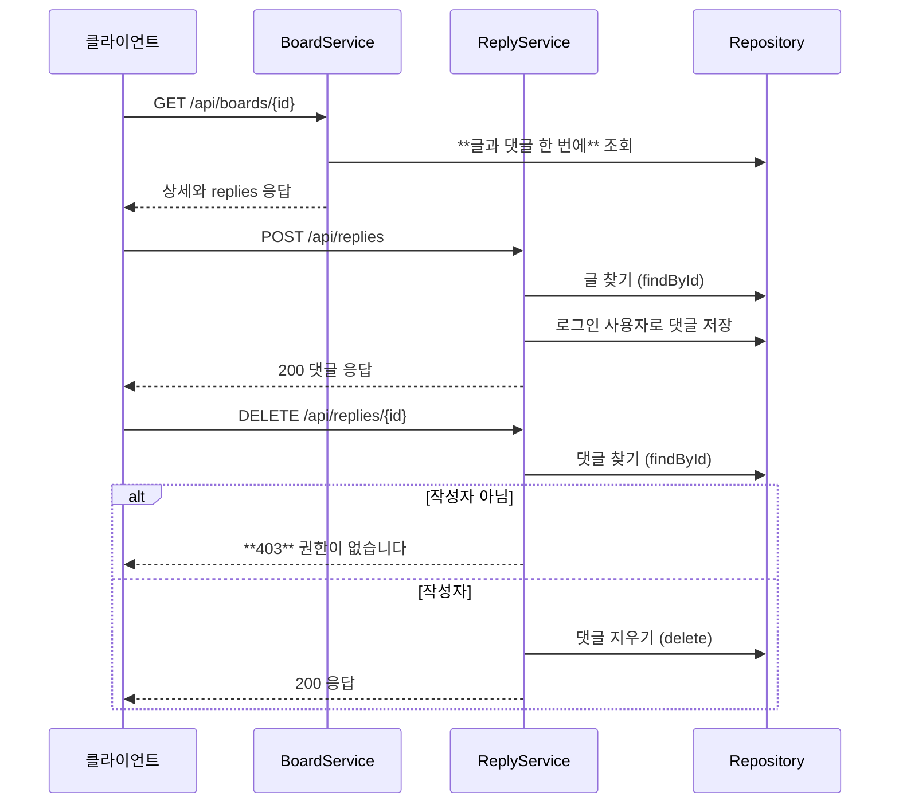

# reply 흐름

```mermaid
sequenceDiagram
  participant C as 클라이언트
  participant BS as BoardService
  participant RS as ReplyService
  participant DB as Repository
  C->>BS: GET /api/boards/{id}
  BS->>DB: **글과 댓글 한 번에** 조회
  BS-->>C: 상세와 replies 응답
  C->>RS: POST /api/replies
  RS->>DB: 글 찾기 (findById)
  RS->>DB: 로그인 사용자로 댓글 저장
  RS-->>C: 200 댓글 응답
  C->>RS: DELETE /api/replies/{id}
  RS->>DB: 댓글 찾기 (findById)
  alt 작성자 아님
    RS-->>C: **403** 권한이 없습니다
  else 작성자
    RS->>DB: 댓글 지우기 (delete)
    RS-->>C: 200 응답
  end
```
