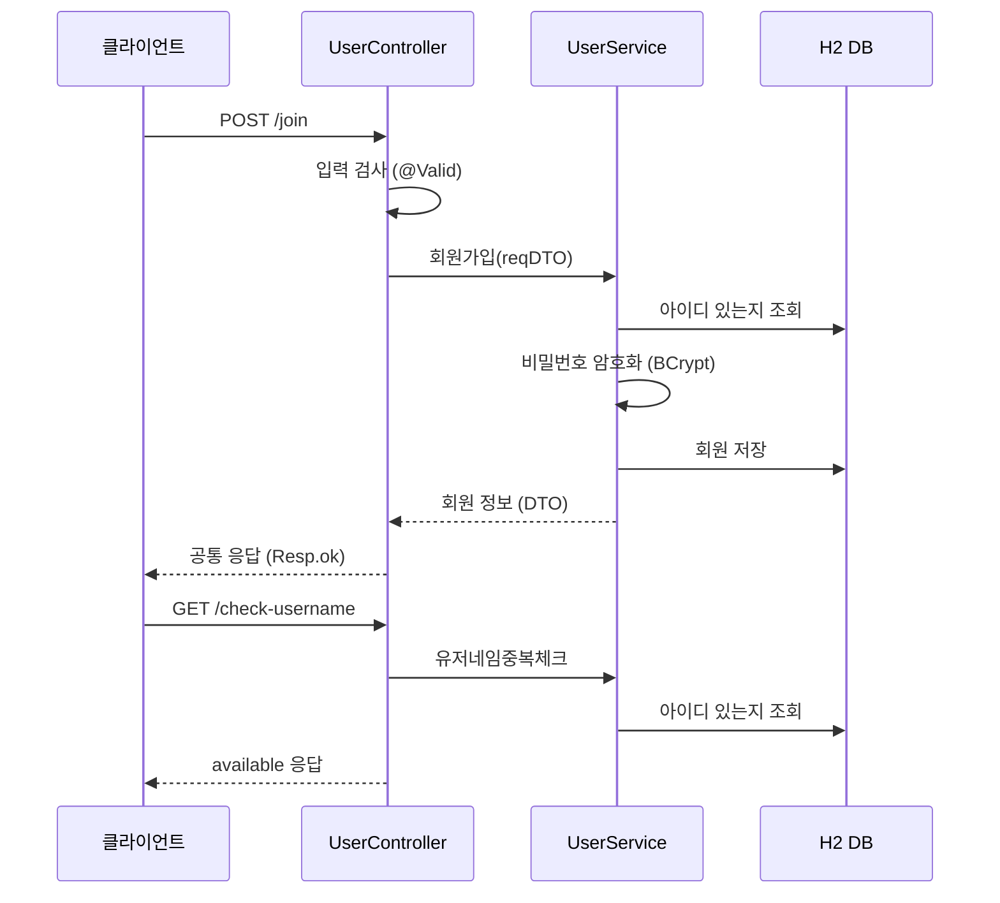

# user-join 흐름

```mermaid
sequenceDiagram
  participant C as 클라이언트
  participant UC as UserController
  participant US as UserService
  participant DB as H2 DB
  C->>UC: POST /join
  UC->>UC: 입력 검사 (@Valid)
  UC->>US: 회원가입(reqDTO)
  US->>DB: 아이디 있는지 조회
  US->>US: 비밀번호 암호화 (BCrypt)
  US->>DB: 회원 저장
  US-->>UC: 회원 정보 (DTO)
  UC-->>C: 공통 응답 (Resp.ok)
  C->>UC: GET /check-username
  UC->>US: 유저네임중복체크
  US->>DB: 아이디 있는지 조회
  UC-->>C: available 응답
```
