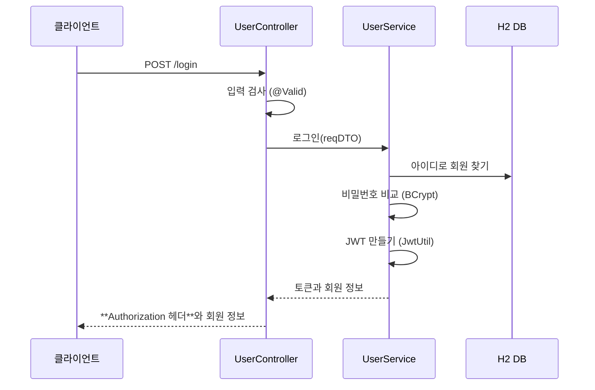

# user-login 흐름

```mermaid
sequenceDiagram
  participant C as 클라이언트
  participant UC as UserController
  participant US as UserService
  participant DB as H2 DB
  C->>UC: POST /login
  UC->>UC: 입력 검사 (@Valid)
  UC->>US: 로그인(reqDTO)
  US->>DB: 아이디로 회원 찾기
  US->>US: 비밀번호 비교 (BCrypt)
  US->>US: JWT 만들기 (JwtUtil)
  US-->>UC: 토큰과 회원 정보
  UC-->>C: **Authorization 헤더**와 회원 정보
```
