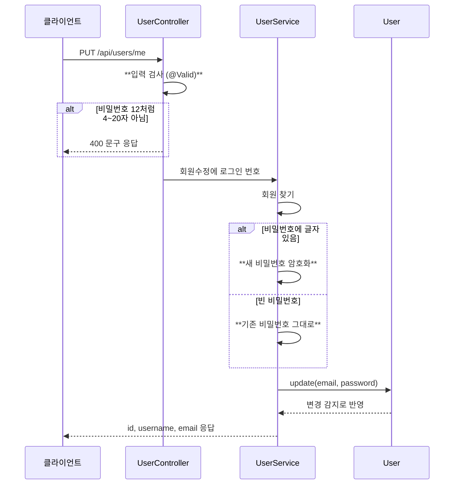

# user-update 흐름

```mermaid
sequenceDiagram
  participant C as 클라이언트
  participant UC as UserController
  participant US as UserService
  participant U as User
  C->>UC: PUT /api/users/me
  UC->>UC: **입력 검사 (@Valid)**
  alt 비밀번호 12처럼 4~20자 아님
    UC-->>C: 400 문구 응답
  end
  UC->>US: 회원수정에 로그인 번호
  US->>US: 회원 찾기
  alt 비밀번호에 글자 있음
    US->>US: **새 비밀번호 암호화**
  else 빈 비밀번호
    US->>US: **기존 비밀번호 그대로**
  end
  US->>U: update(email, password)
  U-->>US: 변경 감지로 반영
  US-->>C: id, username, email 응답
```
