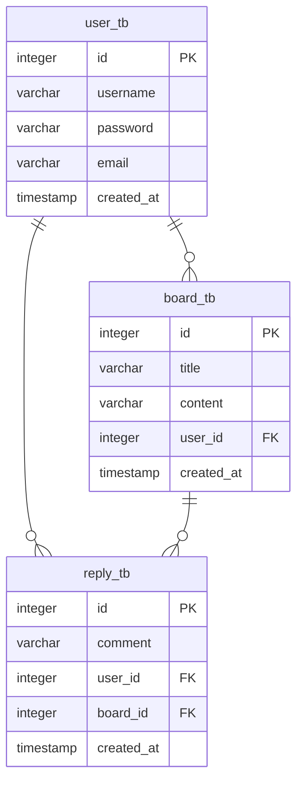

# ERD

기준: reply 장 끝

```mermaid
erDiagram
  user_tb ||--o{ board_tb : ""
  user_tb ||--o{ reply_tb : ""
  board_tb ||--o{ reply_tb : ""
  user_tb {
    integer id PK
    varchar username
    varchar password
    varchar email
    timestamp created_at
  }
  board_tb {
    integer id PK
    varchar title
    varchar content
    integer user_id FK
    timestamp created_at
  }
  reply_tb {
    integer id PK
    varchar comment
    integer user_id FK
    integer board_id FK
    timestamp created_at
  }
```
